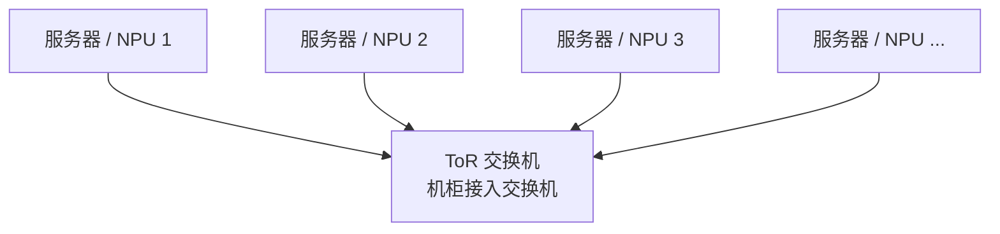
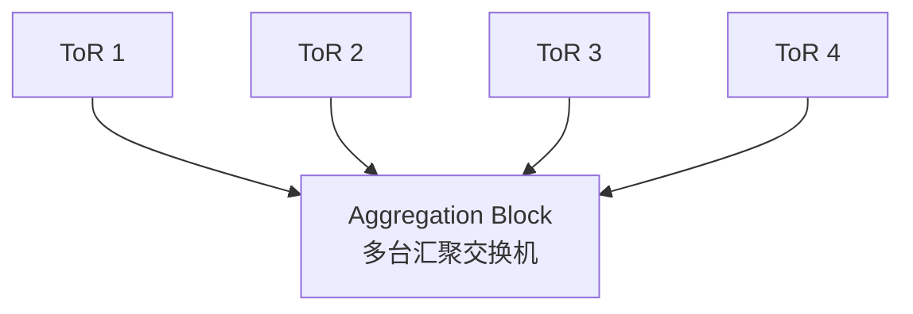
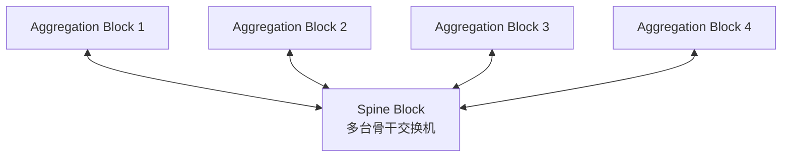
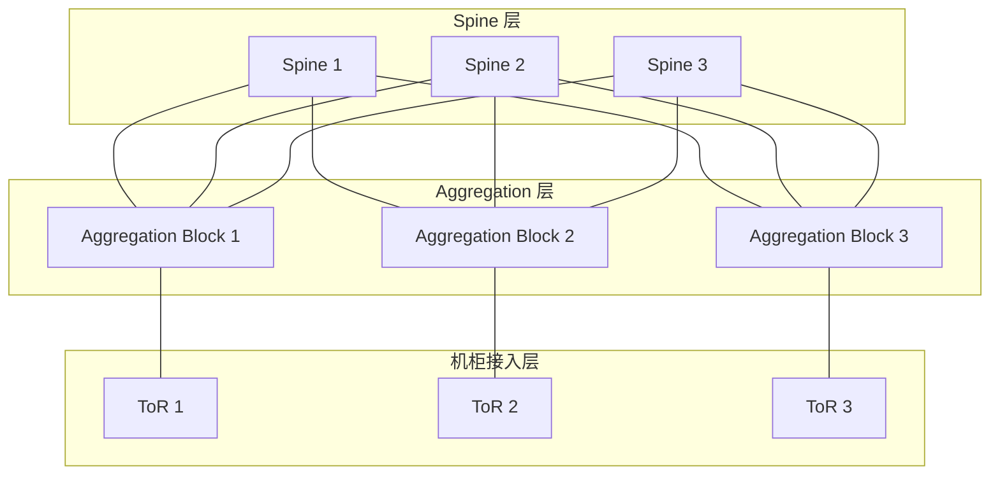
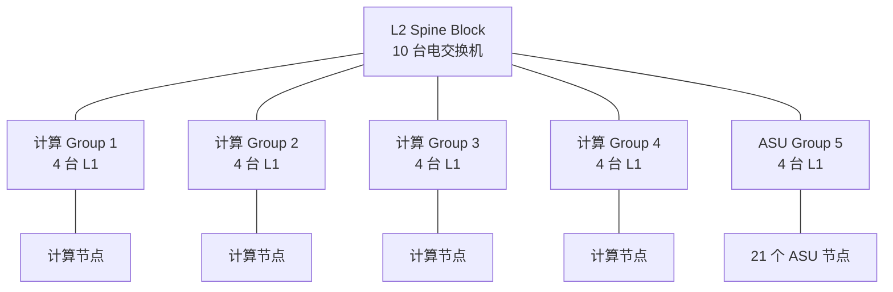

# Clos 数据中心网络基础：ToR、Aggregation Block 与 Spine Block

本文解释 Clos 数据中心网络中的核心组件，并将这些概念映射到本项目的计算/存储拓扑。

## 1. 先纠正一个常见说法

**ToR 不是服务器，而是交换机。**

ToR 是 **Top-of-Rack Switch（机架顶部交换机）**。服务器、NPU 节点或存储设备通常部署在机柜中，通过网线或光纤连接到本机柜的 ToR。



ToR 通常有两类端口：

- 下行端口：连接本机柜内的服务器、NPU、GPU 或存储设备；
- 上行端口：连接更高一级的 Aggregation/Leaf 交换机。

同一 ToR 下的两台服务器通信时，路径可以是：

```text
Server A → ToR → Server B
```

如果两台服务器位于不同机柜，流量通常需要继续经过上层网络。

## 2. Aggregation Block 是什么

Aggregation 意为“汇聚”。Aggregation 层将一组机柜中的 ToR 汇聚起来。



**Aggregation Block 通常不是一台交换机。**它是一个模块化网络单元，可能包含：

- 多台 Aggregation Switch；
- 一组下挂的 ToR 和机柜；
- ToR 到 Aggregation 的下行链路；
- Aggregation 到 Spine 的上行链路；
- 对应的控制、供电、维护和故障域。

使用多台交换机的目的包括：

- 增加端口数和总带宽；
- 避免单点故障；
- 让 ToR 同时连接多个汇聚交换机；
- 提供多条等价路径；
- 支持按 Block 增量部署和维护。

在本项目的抽象中，一个由 4 台 L1 交换机组成的 Group，可以近似看作一个 Aggregation Block。

## 3. Spine Block 是什么

Spine 是“脊柱、骨干”的意思。Spine 层负责连接不同的 Aggregation Block。



Spine Switch 一般不直接连接服务器，而是连接多个 Aggregation Block。Spine Block 同样通常表示一组交换机，而不是单台设备。

它的作用包括：

- 承载跨 Aggregation Block 的流量；
- 为任意两个 Block 提供多条并行路径；
- 在单台 Spine 或单条链路故障时提供绕行路径；
- 提供数据中心范围的骨干带宽。

## 4. 什么是 Clos 网络

Clos 网络是一种多级交换结构。它不用一台端口数极大、价格昂贵的中央交换机连接所有设备，而是用大量较小的交换机构建多级网络。

典型的数据中心 Clos 可以抽象为：



Clos 的关键特征是：每个 Aggregation Block 通常连接多台 Spine Switch。因此，Block 1 到 Block 3 可以同时存在多条路径：

```text
A1 → Spine 1 → A3
A1 → Spine 2 → A3
A1 → Spine 3 → A3
```

这种结构的主要优点是：

- 可通过增加交换机和链路横向扩展；
- 提供较高的双向对分带宽；
- 天然具有路径多样性；
- 单台交换机故障通常只损失部分容量，而不会中断所有连通性；
- 可以使用通用交换芯片构建大规模网络。

## 5. 数据包在 Clos 网络中如何转发

### 5.1 同一 ToR 内通信

```text
Server A → ToR → Server B
```

### 5.2 同一 Aggregation Block、不同 ToR

```text
Server A → ToR A → Aggregation → ToR B → Server B
```

通常不需要经过 Spine。

### 5.3 不同 Aggregation Block

```text
计算节点
  → ToR
  → Aggregation Block 1
  → Spine
  → Aggregation Block 5
  → ToR
  → ASU
```

这是 P/D 分离场景中，计算节点跨 Group 访问存储节点的典型路径。

## 6. Switch 和 Block 的区别

| 名称 | 含义 |
|---|---|
| ToR Switch | 一台连接机柜内端节点的物理交换机 |
| Aggregation Switch | 一台承担机柜汇聚功能的物理交换机 |
| Aggregation Block | 多台汇聚交换机、链路及下挂机柜形成的模块 |
| Spine Switch | 一台连接多个 Aggregation Block 的物理骨干交换机 |
| Spine Block | 多台 Spine Switch 组成的骨干模块 |

简单来说：

- **Switch** 强调一台物理设备；
- **Block** 强调一个可独立部署、扩容、维护和隔离故障的网络模块。

## 7. 两层 Clos、三层 Clos 与 Leaf-Spine

论文中的 ToR、Aggregation、Spine 是逻辑角色，并不要求在所有系统中都对应三类独立设备。

很多数据中心采用两层 Clos，也叫 Leaf-Spine：

- Leaf 同时承担 ToR/接入和 Aggregation 的部分功能；
- Spine 负责连接所有 Leaf。

因此，如果端节点直接连接 L1 交换机，没有单独的机柜交换机，那么 L1 同时承担接入和汇聚角色。

## 8. 与本项目拓扑的对应关系

当前项目中的节点编号为：

- 0～15：计算节点；
- 16～36：ASU 节点；
- 37～52：计算侧 16 台 L1 交换机，组成 4 个 Group；
- 53～56：存储侧 4 台 L1 交换机，组成第 5 个 Group；
- 57～66：10 台 L2 Spine 交换机。

可以对应为：

| 项目对象 | Clos 网络角色 |
|---|---|
| 计算节点、ASU 节点 | 端节点 |
| 5 个 Group 中的 L1 交换机 | Leaf/Aggregation 层 |
| 每个 Group 的 4 台 L1 交换机 | 一个 Aggregation Block |
| 10 台 L2 交换机 | Spine 层/Spine Block |
| L1 到 L2 的链路 | Aggregation 到 Spine 的上行链路 |

整体结构可以简化为：



是否存在独立 ToR，要看物理连接：

- 如果 NPU/ASU 直接连接这些 L1，L1 同时是接入层和 Aggregation 层；
- 如果每个机柜另有交换机，机柜交换机才是 ToR，L1 是纯 Aggregation 层。

## 9. Clos 为什么通常使用 ECMP

两个 Group 之间可以经过多台不同的 Spine。以 Group 1 到 Group 5 为例：

```text
G1 → L2-0 → G5
G1 → L2-1 → G5
...
G1 → L2-9 → G5
```

传统网络通常使用 ECMP，根据五元组进行 Hash：

```text
hash(src_ip, dst_ip, src_port, dst_port, protocol)
```

Hash 结果选择一条 Spine 路径。它简单且不需要集中调度，但可能出现多个大流碰撞到同一路径，而其他路径仍然空闲的问题。

本项目中的确定性组网/确定性路由，可以让控制器根据拓扑、链路容量和业务需求，为大流显式选择一条或少量路径，减少 Hash 碰撞。

## 10. Clos 与 Jupiter OCS Direct-Connect 的关系

Jupiter Evolving 并不是因为 Clos 无法提供高性能，而是为了处理 Clos 在工程上的三个问题：

1. Spine 往往需要按照数据中心最终规模提前部署；
2. 新一代高速 Aggregation Block 可能被旧 Spine 的端口速率限制；
3. Spine 交换机及其光模块带来较高 CAPEX 和功耗。

传统 Clos 的跨 Group 路径是：

```text
Group A → Spine → Group B
```

Jupiter 使用 OCS 构成 DCNI 光互连层后，可以建立：

```text
Group A → OCS 光路 → Group B
```

OCS 负责改变 Layer 1 物理连通关系，Aggregation Block 中的电交换机仍负责逐包查表、排队、拥塞处理和转发。

这种 Direct-Connect 架构降低了 Spine 成本和路径长度，但不再天然支持任意最坏流量矩阵。因此它需要结合：

- Traffic Engineering：在现有直连和单中转路径间分配流量；
- Topology Engineering：按较慢时间尺度调整 OCS 光路；
- 可靠的增量重构流程；
- 对真实流量模式、容量余量和故障域的建模。

对本项目来说，合理的分层是：

- OCS/拓扑工程：按长期业务负载调整 Group 间的物理链路；
- 电交换/流量工程：在固定光拓扑上快速选择直连或单中转路径；
- 不按单个 Mooncake 请求、单个 KV Block 或单层 KV 传输重配 OCS。
