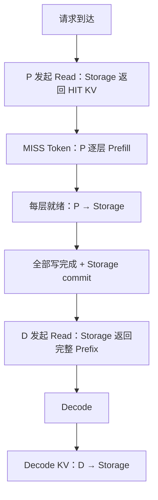

# Mooncake 到 ns-3-UB 的两阶段转换说明

## 1. 建模目标

本流水线要把应用语义和网络仿真解耦：

1. `trace → DAG` 决定请求包含哪些计算、存储和网络任务，以及任务依赖；
2. `DAG → traffic` 只保留会在 UB 网络中产生流量的任务，把计算/存储耗时折叠为 delay；
3. ns-3-UB 再根据拓扑、路由、链路带宽、排队和拥塞决定每条流的真实完成时间。

它不是 Mooncake 所有实现细节的复刻，而是一个明确的 v6 layer-pipelined 模型。

## 2. 单请求完整流程



关键语义：

- HIT block 由 P 向 Storage 发起 `MEM_LOAD`，响应携带 KV 返回 P；
- Prefill 只计算 MISS token；
- 每层计算完成后，立即写该层的**完整 Prefix KV**，不仅是 MISS block；
- 第 `i` 层网络写不阻塞第 `i+1` 层计算，二者可重叠；
- D 在所有 P→Storage 写和 commit 完成后向 Storage 发起 `MEM_LOAD`，响应返回完整 Prefix；
- Decode 完成后，生成的 KV 合并成一次 D→Storage 写；
- P/D 无亲和关系，也没有 P→D 直连流量。

## 3. 第一阶段：trace → task DAG

### 3.1 输入格式

输入是 JSONL，每行一个请求：

```json
{"timestamp": 100, "input_length": 1024, "output_length": 32, "hash_ids": [101, 102]}
```

| 字段 | 单位/含义 |
|---|---|
| `timestamp` / `timestamp_ms` | 毫秒；转换成 DAG 时乘 1000 得到微秒 |
| `input_length` | 输入 token 数 |
| `output_length` | 输出 token 数 |
| `hash_ids` | Prefix KV block 的稳定标识 |

一个完整 block 的字节数：

\[
B_{block}=tokens_{block}\times kv\_bytes\_per\_token
\]

最后一个 hash block 可以不足 `block_tokens`。脚本假定 `hash_ids` 数量与
`ceil(input_length / block_tokens)` 一致；若不一致，token/流量估算可能失真。

### 3.2 Cache 命中

脚本维护历史集合 `seen_blocks`，通过 `hash_id in seen_snapshot` 判断命中。
这表示 **block 独立命中**，不是最长连续 Prefix：

| 请求 | 缓存 | 当前结果 |
|---|---|---|
| `[10, 11, 12]` | `{10, 12}` | `HIT, MISS, HIT` |

同一时间戳的请求共享处理前快照，因此不会因为 Python 的遍历顺序互相制造命中。
但 block 会在该时间戳处理结束后立刻进入历史集合，尚未与前一请求真实的
P→Storage 完成时间绑定。

`--warmup-requests N` 让前 N 个请求只更新缓存历史和 debug，不生成正式任务。

### 3.3 节点放置

- P：对前若干个非排除 hash 构成的 Prefix Key 做稳定 SHA-256 映射；
- D：对 `request_id` 做稳定映射，与 P 无亲和；
- Storage：对 block hash 做稳定映射；
- Decode KV：对 `decode:<request_id>` 做 Storage 映射；
- 端口：对方向、请求和 block/tag 做稳定映射。

脚本不用 Python 内置 `hash()`，因为它可能在不同进程中随机化。

### 3.4 DAG 任务类型

| task_type | task_class | 路径/作用 | 关键依赖 |
|---|---|---|---|
| `PREFIX_READ` | NETWORK | P→Storage 发起 Read；响应 Storage→P | 绝对释放时间包含折叠的 Storage 访问延迟 |
| `PREFILL_LAYER` | COMPUTE | P 逐层计算 MISS token | Layer 0 等全部 HIT read；层间串行 |
| `PREFIX_STORE_WRITE` | NETWORK | P→Storage，逐层写完整 Prefix | 第 i 层写只等第 i 层计算 |
| `PREFIX_STORE_COMMIT` | TIMER | 固定 Storage commit 延迟 | 等全部 Prefix write |
| `STORAGE_TO_D` | NETWORK | D→Storage 发起 Read；响应 Storage→D | 等 commit |
| `DECODE` | COMPUTE | D 上的 Decode | 等全部 Storage→D |
| `DECODE_WRITE` | NETWORK | D→Storage，写输出 KV | 等 Decode |

网络任务的 `duration_us=0`。真实网络耗时由 ns-3-UB 计算。

### 3.5 逐层流水

总 Prefill 时间为：

\[
T_{prefill}=miss\_tokens\times prefill\_us\_per\_token
\]

脚本把整数微秒平均拆到 `num_layers` 层，并记录每层累计就绪时间
`layer_ready_offset_us`。第 i 层计算同时解锁：

- 下一层 Prefill 计算；
- 所有 block 的第 i 层 P→Storage 写。

因此 DAG 允许计算与网络重叠；同层多个 block 的写也可以同时 Ready，实际串行或排队
由 ns-3 端口和链路模型决定。

## 4. 第二阶段：DAG → UB traffic

### 4.1 输出字段

| traffic.csv 字段 | 来源/语义 |
|---|---|
| `taskId` | 转换器重新分配的全局网络任务 ID |
| `sourceNode` / `destNode` | DAG 的 `src_node` / `dst_node` |
| `dataSize(Byte)` | DAG `bytes`；超过 uint32 最大值时拆分 |
| `opType` | 读取映射 `MEM_LOAD`，写入映射 `MEM_STORE`；均由 P/D 向 Storage 发起 |
| `priority` | `--priority`，默认 7 |
| `delay` | 绝对释放时间或前驱 phase 完成后的相对等待 |
| `phaseId` | 同一请求、同一网络 stage 共享一个 phase |
| `dependOnPhases` | 必须整体完成的前驱 phase |

### 4.2 四个 phase

| Phase | delay | dependOnPhases |
|---|---|---|
| `PREFIX_READ` | DAG `release_time_us` | 空 |
| `PREFIX_STORE_WRITE`（有 HIT） | 每行 `layer_ready_offset_us` | `PREFIX_READ` phase |
| `PREFIX_STORE_WRITE`（无 HIT） | DAG `release_time_us` | 空 |
| `STORAGE_TO_D` | commit task 的 `duration_us` | `PREFIX_STORE_WRITE` phase |
| `DECODE_WRITE` | Decode task 的 `duration_us` | `STORAGE_TO_D` phase |

同一 phase 内的所有任务必须完成，后继 phase 才能释放。超过
`UINT32_MAX` 的一条流拆出的多个 chunk 仍属于同一 phase，因此依赖语义不变。

### 4.3 最重要的实现边界

`task_dag_to_ub_traffic.py` **不是通用 DAG 调度器**：

- 它不解析 `depends_on` 字段来构建任意 task-level DAG；
- 它识别固定的 v6 `task_type`，再重建四个网络 phase；
- `PREFILL_LAYER`、`PREFIX_STORE_COMMIT`、`DECODE` 只用于提取 delay/debug；
- 新增 task type 不会自动进入 `traffic.csv`，必须同步扩展映射和依赖逻辑。

这种处理适合当前 ns-3-UB 的 phase 输入接口，但修改第一阶段 DAG 语义时必须同时检查第二阶段。

## 5. 配置说明

| 配置 | 含义 |
|---|---|
| `model.kv_bytes_per_token` | 全模型所有层合计的单 token KV 字节数 |
| `model.block_tokens` | 一个 hash block 的 token 数 |
| `model.num_layers` | Prefill/Prefix 写拆分层数，默认 78 |
| `timing.prefill_us_per_token` | Prefill 计算时间模型 |
| `timing.decode_us_per_token` | Decode 计算时间模型 |
| `timing.storage_latency_us` | 读取前/写后 commit 的固定延迟 |
| `compute.p_nodes` / `d_nodes` | P、D 的 ns-3 节点 ID |
| `compute.server_ports` | DAG debug/放置所用服务器端口集合 |
| `storage.nodes` / `ports` | Storage 节点和端口集合 |
| `compute.p_placement.hash_blocks` | P 放置使用的 Prefix Key 长度 |
| `exclude_hash_ids` | 仅从 P 放置 key 排除，不影响 cache 命中 |

示例配置使用 P 节点 `0..11`、D 节点 `12..15`、Storage 节点 `16`。其中性能参数
仅用于保证示例可运行，必须用真实模型结构、KV 精度和硬件测量结果校准。

## 6. 已知简化

- Cache 容量无限，无淘汰；
- Cache 是 hash 集合命中，不要求最长连续 Prefix；
- 新 block 的可见性按 trace 时间戳推进，不等待真实 DAG 写完成；
- 全命中请求仍会把完整 Prefix 从 P 重写到 Storage；
- D 的 Prefix Read 不做逐层流水；
- Decode 及 Decode 写回均按整个输出聚合；
- DAG 没有表达同一 P/D 节点上多个请求的计算资源排队；
- 端口字段不会进入当前 `traffic.csv`，最终链路/端口选择取决于 ns-3-UB 配置。

## 7. 调试建议

1. 先检查 `requests_debug.csv` 的 HIT/MISS、P/D 分布和 Prefix 总字节；
2. 检查 `summary.json` 中各方向总流量是否符合公式；
3. 用 `traffic_phase_debug.csv` 核对每个请求的四个 phase 和三类折叠延迟；
4. 在小 trace 上确认后，再转换完整 trace；
5. 若改变全 Prefix 重写、Storage→D 流水或 cache 可见性，两个脚本和文档应一起修改。
